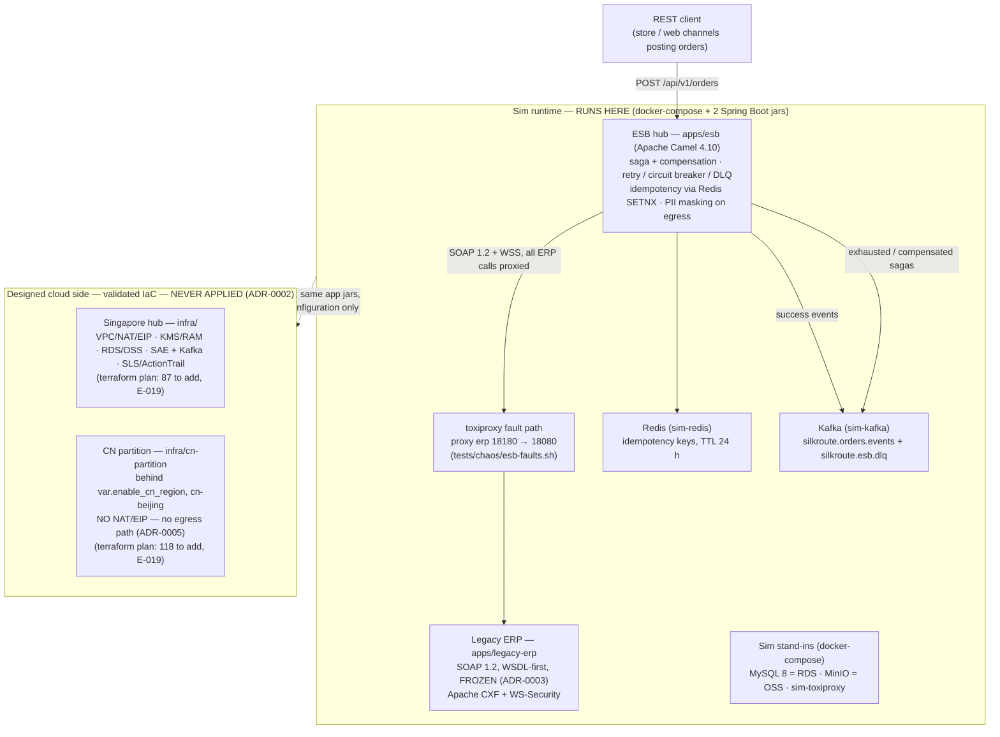

# SilkRoute — Multi-Region Alibaba Cloud Integration Platform

[](https://github.com/xenoaitham/silkroute/actions/workflows/ci.yml)

> **Self-directed reference implementation (2026).** The scenario company **Maple Retail Group** is **fictional** — no real client, employer, or engagement is implied ([docs/scenario-charter.md](docs/scenario-charter.md)). The project lives under *Projects*, never *Experience*. In an interview the framing is volunteered, not discovered: *"I built a reference implementation of exactly the problem your JD describes — a Canadian retailer's APAC expansion on AliCloud. Let me walk you through it."* (MASTER_PROMPT §9, rule 3.)

SilkRoute is a multi-region enterprise integration platform for the fictional Canadian retailer (300 stores + e-commerce) entering **Singapore** (international hub) and **mainland China** (PIPL data-residency partition). It mediates modern REST traffic into an untouchable SOAP ERP estate on Apache Camel — saga orchestration with compensation, retry/circuit-breaker/DLQ, idempotent consumption, region-based PII masking — and pairs that with a Terraform (`alicloud`) landing zone, CI-provable data-residency checks, measured load/chaos evidence, and a cost model priced from fetched pricing pages. Everything runtime-provable runs locally in **sim mode** at zero cloud spend; the cloud side is **validated IaC** — schema- and plan-proven, never applied, creating nothing ([ADR-0002](decisions/ADR-0002-cloud-account-path.md)).

**Status: 7 of 9 planned phases complete; the docs & demo phase is in final review** — the ETL data-plane phase (CDC + Spark lake) is designed-not-built and no numbers are claimed for it. **27 evidence rows** in the ledger ([evidence/EVIDENCE.md](evidence/EVIDENCE.md), E-001..E-027), each with a re-runnable command. CI is green 4/4 (run 34748892370, sha b5f3771).

## Architecture

Solid = what actually runs here (sim mode). Dashed = the designed cloud side — **validated IaC — never applied**: plans create nothing.



## Quickstart (sim mode — default, zero cloud spend)

Prerequisites: **Docker** (with compose; rootless works — `docker context use rootless` if applicable), **jq**, **curl**, and **JDK 17+** for the Java services. The repo's Maven Wrapper `./mvnw` is pinned to Maven 3.9.9 — no Maven install is ever needed. Free host ports per the table below (everything binds 127.0.0.1 only).

Host ports (what a client on your machine connects to):

| Service | Host port | Why not the default |
|---|---|---|
| MySQL | 3306 | default |
| Kafka | **39092** | 9092 stays internal: bootstrap metadata advertises the in-compose name `kafka:9092`; host clients use the HOST listener advertised as `localhost:39092` |
| Redis | **16379** | 6379 often collides with a pre-existing local Redis; container port stays 6379 |
| MinIO | 9000 (API) / 9001 (console) | defaults |
| Toxiproxy (sim) | 8474 (API) | default |
| esb-toxiproxy | **18474 (API) / 18180 (ERP proxy)** | 8474/8475 are taken by the sim + an unrelated stack's toxiproxies; it runs host-networked because a bridge container cannot upstream to a host-loopback service |
| legacy-erp (SOAP) | **18080** | 8080 is taken by an unrelated stack on this shared host; loopback-only |
| ESB REST / management | **18081 / 18082** | actuator is split off the API port; both loopback-only |
| ERP (contract tests) | **18090** | test-run app instance so the Karate suite never collides with a manually started ERP |

Every command below was executed verbatim, with the observed result noted. From a clean checkout:

```bash
make up && make smoke     # → "smoke OK (all 6 services, host forwards + in-container)", exit 0
./mvnw -B -f apps/legacy-erp/pom.xml clean package    # → Tests run: 17, BUILD SUCCESS
./mvnw -B -f apps/esb/pom.xml clean package           # → Tests run: 33, BUILD SUCCESS
make esb-run              # → ERP health {"status":"UP"} (18080), ESB health UP (18082), REST on 18081
scripts/demo-order.sh     # → HTTP 201: orderId ORD-2026-00000N, saga order/reserve/pricing/confirm all
                          #   COMPLETED, attempts all 1, route {"region":"CA","customerRefMasked":false},
                          #   totalAmount {"amountMinor":1000,"currency":"CAD"} (2 × 500 minor, SKU-0001 @ 500 CAD)
bash tests/chaos/esb-faults.sh latency 800
scripts/demo-order.sh demo-lat    # → HTTP 201 again but ~3.3 s slower (4 proxied ERP calls × 800 ms;
                                  #   the measured degradation shape, E-022)
bash tests/chaos/esb-faults.sh disable
scripts/demo-order.sh demo-down   # → HTTP 503 {"code":"UPSTREAM-UNAVAILABLE"} — bounded fail after retry
                                  #   exhaustion (~0.6 s); repeat rapidly → breaker opens →
                                  #   {"code":"CIRCUIT-OPEN"} fail-fast
bash tests/chaos/esb-faults.sh clean
scripts/demo-order.sh demo-heal   # → HTTP 201 again (allow ~2 s for the breaker's wait-in-open window)
make esb-stop             # → kills by recorded PID files, releases 18080/18081
make plan-sg              # → "Plan: 87 to add, 0 to change, 0 to destroy." — PLANS CREATE NOTHING
                          #   (no AliCloud account, no credentials, zero API calls; ADR-0002)
```

Idempotency, by design: re-posting the **same** `Idempotency-Key` after a 201 — `scripts/demo-order.sh <same-key-again>` — returns **HTTP 409 `{"code":"DUPLICATE"}` carrying the original orderId** (E-008).

## Honest modes — what is proven where

| Mode | Meaning | What it covers |
|---|---|---|
| **Sim runtime** | Actually runs here; every number below is measured on it | ESB mediation, saga/compensation, retry/breaker/DLQ, idempotency, PII masking, load & chaos numbers, audit-query demo |
| **Validated IaC** | Schema- and plan-proven against the real `alicloud` provider — **never applied**, no account exists | All of `infra/` (87-resource SG plan, 118 with the CN flag, E-019); residency static checks R1–R7 (E-016) |
| **Not run** | Designed, nothing claimed until it happens — **verify at activation** | SLS runtime behavior (alerts/indexes/ingest), real cloud costs (the sheet is designed 24/7, not billed), the CN partition (plan-validated only, ADR-0005), runtime residency behavior, CDC freshness (no producer exists) |

Cost headline: the designed 24/7 Singapore footprint prices at **949.64 USD/month** — dominated by the KMS software instance (~53%) and the Kafka instance (~32%) — the quantified argument for sim-first (E-025, [docs/cost-model.md](docs/cost-model.md)). An AliCloud account would unlock: real SLS ingest/alerts, KMS envelopes, RDS/OSS behavior, runtime residency proof, and CN activation — the step-by-step is the activation runbook in [docs/runbooks.md](docs/runbooks.md).

## Repository map

| Path | Contents |
|---|---|
| [MASTER_PROMPT.md](MASTER_PROMPT.md) | Project constitution (mission, scenario constraints C1–C7, protocols) |
| [ROADMAP.md](ROADMAP.md) | Phase status board |
| [STATE.md](STATE.md) | Current state, session log |
| [evidence/EVIDENCE.md](evidence/EVIDENCE.md) | The evidence ledger, E-001..E-027 — claim → artifact → reproduce command → measured result |
| [decisions/](decisions/) | 5 ADRs (one-liners below) |
| [apps/legacy-erp/](apps/legacy-erp/) | Frozen WSDL-first SOAP ERP (Spring Boot + CXF) |
| [apps/esb/](apps/esb/) | Apache Camel integration hub (saga, resilience, idempotency, masking) |
| apps/modern-oms, apps/cdc, apps/batch | Designed data plane — placeholders, not built |
| [infra/](infra/) | Terraform alicloud landing zone (validated plans, never applied) |
| [compliance/](compliance/) | Control matrix, cross-border memo, STRIDE, audit-trail design |
| [tests/](tests/) | Karate contract, ESB fault-injection suite, k6 load, chaos harness |
| [docs/](docs/) | HLD, LLD, runbooks, delivery model, SLO report, cost model, ICP runbook |

**Decision log (5 ADRs, one line each):**

- [ADR-0001](decisions/ADR-0001-dual-mode-sim-cloud.md) — dual-mode: sim (docker-compose) is the default runtime; the cloud swap is configuration/Terraform only, never code changes.
- [ADR-0002](decisions/ADR-0002-cloud-account-path.md) — no account exists: validated-plans mode; every cloud row is "validated IaC, sim runtime."
- [ADR-0003](decisions/ADR-0003-wsdl-contract-freeze.md) — the ERP's WSDLs/XSDs are frozen (tag `contract-freeze-erp-v1`); all impedance mismatch lives in the ESB (C6).
- [ADR-0004](decisions/ADR-0004-sae-over-ack-and-budget-alarm.md) — SAE over ACK for compute; budget alarm via BssOpenApi script because the provider ships no budget resource.
- [ADR-0005](decisions/ADR-0005-region-strategy-sg-hub-cn-partition.md) — Singapore hub; CN partition designed and plan-validated behind a flag, never applied.

**Further reading:** [docs/slo-report.md](docs/slo-report.md) (measured SLOs) · [docs/cost-model.md](docs/cost-model.md) (priced cost sheet) · [tests/chaos/README.md](tests/chaos/README.md) (chaos runbook) · [docs/interview/](docs/interview/) · [docs/hld.md](docs/hld.md) · [docs/lld.md](docs/lld.md) · [docs/delivery-model.md](docs/delivery-model.md) · [docs/runbooks.md](docs/runbooks.md).
