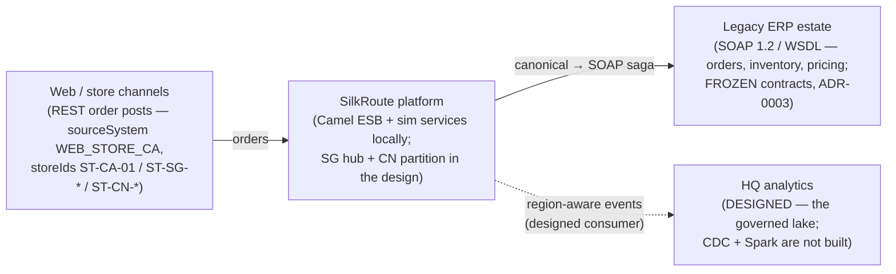
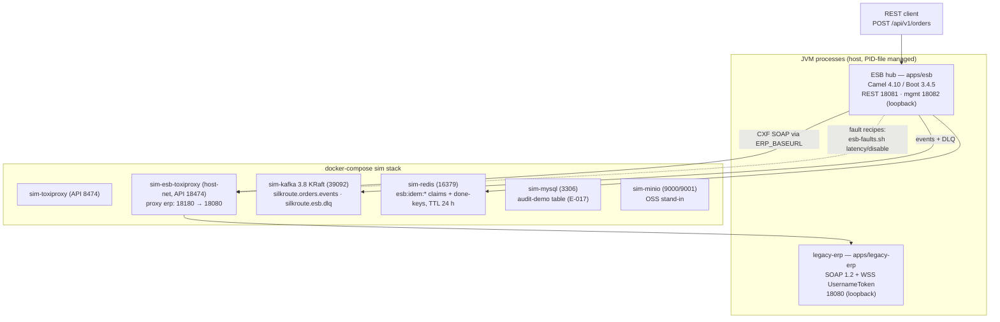
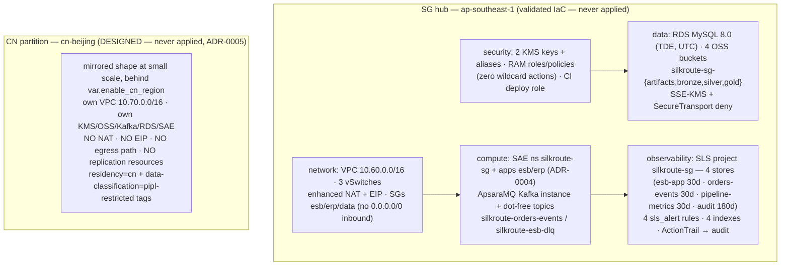

# SilkRoute — High-Level Design

Maple Retail Group is a **fictional** Canadian retailer; this document is part of a **self-directed reference implementation** (2026), not a client engagement. Framing per MASTER_PROMPT §9: the project lives under *Projects*, never *Experience*.

**Doc status, stated once and applying throughout:** the left side of every diagram in this document — the ESB, the frozen SOAP ERP, the sim data services, and all measured behavior — **runs here today** in sim mode (docker-compose + two Spring Boot jars, everything on host loopback). The right side — the AliCloud landing zone — is **validated IaC: schema- and plan-proven against the real `alicloud` provider, never applied** (ADR-0002; no account exists, plans create nothing). The CN partition is additionally **designed and plan-validated only** (ADR-0005). SLS runtime behavior and real cloud costs verify at activation. CDC freshness is design-only — the Phase 3 producer does not exist, and no number is claimed for it.

## 1. Scenario constraints (C1–C7, verbatim from [MASTER_PROMPT.md](../MASTER_PROMPT.md) §2)

| # | Constraint | Consequence |
|---|---|---|
| C1 | Chinese-customer PII must remain in the China region (PIPL) | Region-pinned storage, masked egress for analytics, residency tests in CI |
| C2 | Singapore region is the international hub | No ICP needed for internal APIs; public web presence in mainland CN requires ICP filing (document the process precisely) |
| C3 | Sync SOAP mediation p95 latency < 300 ms in-region | Measure with k6; record real numbers |
| C4 | CDC freshness ≤ 15 min; T+1 batch complete by 06:00 Singapore time | Freshness monitor + batch window scheduler + evidence |
| C5 | Multi-currency (CAD/SGD/CNY), multi-timezone batch windows | Money as minor units + currency code; timezone-explicit scheduling |
| C6 | The ERP team will NOT modify their WSDLs | All impedance mismatch handled in the ESB layer (XSLT, canonical model) |
| C7 | Canada HQ subject to PIPEDA; cross-border transfer must be documented | PIPL Art. 38–40 transfer mechanism memo (CAC security assessment / standard contract / certification) |

## 2. System context (C4 context level)

Every box below is a real repo artifact or a documented contract; dashed = validated IaC, never applied.

The regulator reality (PIPL/PDPA/PIPEDA obligations) is deliberately **not** drawn as a box: it is enforced as machine-checked controls, not a network hop — see §5 and [compliance/](../compliance/).

## 3. Container view — two modes

### 3.1 Sim mode (what actually runs)

From [docker-compose.yml](../docker-compose.yml) plus the two built jars.

Fault injection is the two-toxiproxy design documented in `apps/esb/README.md`: the bridge-mode sim proxy cannot upstream to a host-loopback service, so the ESB's ERP path gets its own host-networked toxiproxy (18180 → 18080). All fault recipes run through [tests/chaos/esb-faults.sh](../tests/chaos/esb-faults.sh).

### 3.2 Designed cloud mode (validated IaC — never applied)

From the Terraform modules under [infra/](../infra/) (provider `alicloud` pinned 1.285.0). Dashed = plan-proven only: `terraform plan` performs zero AliCloud API calls and creates nothing (E-019: SG `Plan: 87 to add`, CN `Plan: 118 to add`).

There is **no arrow between the SG hub and the CN partition** — that absence is the design. The CN partition has no egress path (no NAT/EIP), no cross-region replication/backup resources, and its bucket family never crosses with the SG one; all three properties are machine-checked by the residency suite ([scripts/residency-tests.sh](../scripts/residency-tests.sh), R3/R5/R6).

## 4. ESB pattern inventory

Each pattern, with the evidence row that proves it rather than claims it.

- **Saga + compensation.** A hand-rolled orchestrator (`saga/SagaOrchestrator`, deliberately not the Camel saga EIP) runs order → reserve (per line) → pricing (per line) → confirm. Failure after reserve compensates by releasing every collected reservation id, on a breaker-free route so compensation works while the breaker is OPEN. Proven under injection: a failed pricing step leaves ERP stock 19→19 with `compensated:true` (E-009).
- **Content-based routing by store region.** The region derives from the store id prefix (CA/SG/CN) and is visible in the response `route` object, e.g. `{"region":"CA","customerRefMasked":false}` for a CA store (E-008); the same routing key decides whether egress masking applies (below).
- **Retry ladder.** 3 attempts × 200 ms initial × 2.0 multiplier, on INFRA failures only — business faults (e.g. out-of-stock) return immediately and never touch the ladder. Proven: `attempts` counted per ERP call under persistent latency (E-009).
- **Circuit breaker.** resilience4j via the Camel EIP on the single ERP funnel `direct:erp`: 50% failure rate / sliding window 10 / minimum 6 calls / open 2 s / 3 half-open probes; only `ErpInfraException` is recorded. Proven: hard-down ERP → CIRCUIT-OPEN fail-fast measured at 4 ms (E-009). One honest limitation measured in the load-and-chaos phase: the breaker and the retry ladder are **structurally blind to executor saturation** — when the default 8-worker task executor queue-then-timed-out under 800 ms latency, the ERP calls themselves kept succeeding, so neither mechanism ever saw a failure to act on; the fix was bounded pool sizing, not resilience tuning (E-022).
- **Dead-letter queue.** Sagas that exhaust retries (or compensate) publish a complete, replayable envelope to `silkroute.esb.dlq`. Proven: DLQ 0 → 59 during a hard-down window with all envelope fields verified by inspection (E-023; field list in [docs/lld.md](lld.md)).
- **Idempotent consumer.** Claim = Redis SETNX (`esb:idem:<key>`, TTL 24 h); key = `Idempotency-Key` header else sha256(sourceSystem + externalOrderRef); completion stores the 201 result at `esb:idem:done:<key>`. Proven: same-key replay → 409 DUPLICATE carrying the original orderId (E-008); during a Redis outage the store degrades to allow-through and the frozen ERP's ORD-DUP-REF guard backstops duplicates — allow-through engaged 0.9 s into the measured outage (E-024).
- **PII masking / pseudonymization on egress.** `PiiMaskingPolicy` is wired before EVERY shared-topic publish; CN customer refs are pseudonymized with a keyed HMAC (sim secret `PII_MASK_SECRET`) and surface as `msk-*` values (E-009). The single-publish-chokepoint wiring is machine-checked by residency check R7 (E-016).

## 5. Region & residency story

The region strategy is Singapore hub + CN partition ([ADR-0005](../decisions/ADR-0005-region-strategy-sg-hub-cn-partition.md)):

- **CN pinning is enforced at the provider graph, not by tags.** The cn-partition module receives the aliased `alicloud.cn` provider via the `providers` meta-argument — without the alias every "CN" resource would silently land in ap-southeast-1 and residency would be tags-only theater.
- **No egress path and no replication path.** No NAT gateway, no EIP, zero cross-region replication/backup/mirror resources anywhere in the IaC; bucket families (`silkroute-cn-*` vs `silkroute-sg-*`) never cross.
- **Machine-checked in CI.** `scripts/residency-tests.sh` runs 7 static checks (R1 provider-graph pinning … R7 single Kafka publish chokepoint through the masking policy) plus a 5-mutation selftest that proves the suite is falsifiable (E-016).
- **Regulatory mapping is referenced, not restated:** the PIPL/PDPA/PIPEDA control matrix with article-level citations is [compliance/control-matrix.md](../compliance/control-matrix.md); the Canada↔Singapore transfer analysis and the deliberate CN non-transfer are [compliance/cross-border-transfer-memo.md](../compliance/cross-border-transfer-memo.md); the mainland public-endpoint process is [docs/icp-filing-runbook.md](icp-filing-runbook.md). Honest label: runtime compliance behavior is **verify at activation** (ADR-0002).

## 6. Observability design

Designed in [infra/observability/](../infra/observability/) — plan-proven (E-019), **never ingested from**:

- **4 SLS stores** in project `silkroute-sg`: `esb-app` (30 d), `orders-events` (30 d), `pipeline-metrics` (30 d), `audit` (180 d).
- **4 `alicloud_sls_alert` rules**: DLQ depth, C3 p95 budget breach, denied-action burst, trail-tamper tripwire.
- **4 `alicloud_log_store_index`** resources — the query-facing stores ship their indexes.
- **The `pipeline-metrics` store + freshness panel** are the receiving end for the CDC freshness contract (`{"metric":"cdc_freshness_seconds"|"batch_completion","value":N,"pipeline":"cdc"|"batch"}`) — the panel title reads "awaiting Phase 3 producer"; the store is empty until that producer exists (C4 design-only).

Thresholds, store schemas, and the known trade-offs live in [infra/observability/README.md](../infra/observability/README.md) — that file stays the alert authority; this doc does not restate its tables.

## 7. The dual-mode architecture is a first-class fact

Two decisions shape everything above and are architecture, not process:

- **ADR-0001 (dual-mode):** docker-compose sim is the default build/test/demo runtime; all application code speaks only to interfaces (Kafka wire protocol, JDBC, S3 API), so the sim↔cloud swap is configuration/Terraform only, never code changes.
- **ADR-0002 (validated-plans):** no AliCloud account exists, so every cloud claim is "validated IaC, sim runtime" — plans prove the HCL schema, never a deployment. The boundary is enforced mechanically: `make deploy-sg`/`make destroy` refuse without `SILKROUTE_CLOUD_CONFIRM=YES` **and** credentials (E-014).
- **The cost sheet is the quantified argument for this model:** the designed 24/7 SG footprint is **949.64 USD/month** — the KMS software instance (500 USD/mo, ~53%) and the Kafka instance (306 USD/mo, ~32%) alone are ~85% of it (E-025). Sim-first plus destroy-after-evidence is the honest operating consequence, not a shortcut.
