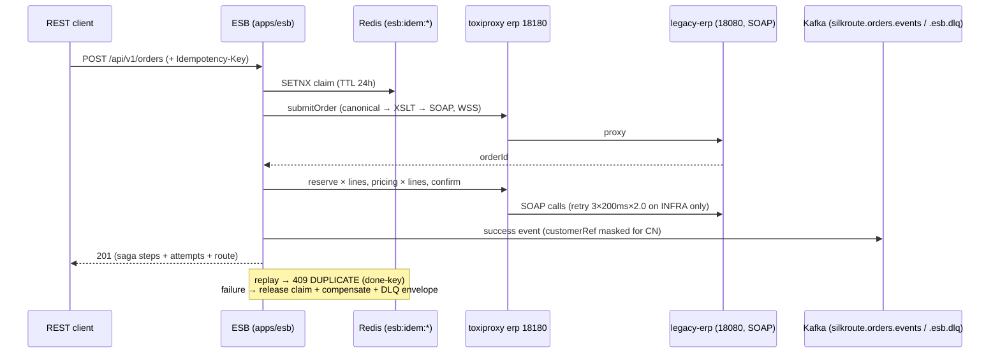

# SilkRoute — Low-Level Design

Maple Retail Group is a **fictional** Canadian retailer; this document is part of a **self-directed reference implementation** (2026) (MASTER_PROMPT §9 framing). Everything here is sourced from the real files it names — `apps/esb/src/main/resources/application.yml`, the `infra/` modules, and the evidence ledger ([evidence/EVIDENCE.md](../evidence/EVIDENCE.md)) — every number carries its E-row. Doc status: the ESB configuration below **runs in sim today**; the infra/SLS layer is **validated IaC — plan-proven, never applied** (ADR-0002), and the CN partition is designed and plan-validated only (ADR-0005).

## 1. ESB configuration — every knob in `application.yml`

Source of truth: [apps/esb/src/main/resources/application.yml](../apps/esb/src/main/resources/application.yml). Every knob uses `${VAR:default}` indirection; defaults are the documented sim dummies.

| Knob | Value | Rationale (one line) |
|---|---|---|
| `server.address` | `127.0.0.1` | loopback-only bind policy on the shared sim host |
| `server.port` (`SERVER_PORT`) | `18081` | REST façade; 18081 avoids the host's occupied 8080 band |
| `spring.task.execution.pool.core-size` | `32` | **chaos fix (E-022)**: the Spring default (core 8, UNBOUNDED queue) turned 800 ms ERP latency × 10 RPS into queue-then-30s-timeout (485 `AsyncRequestTimeoutException`) while the ERP calls themselves succeeded; 32 core > 10 RPS × ~3.2 s degraded sagas |
| `spring.task.execution.pool.max-size` | `64` | headroom over core; part of the same bounded-pool fix (E-022) |
| `spring.task.execution.pool.queue-capacity` | `200` | BOUNDED queue converts saturation into bounded waiting instead of a silent 30 s queue-then-timeout (E-022) |
| `spring.data.redis.host` / `.port` (`REDIS_HOST`/`REDIS_PORT`) | `127.0.0.1:16379` | sim Redis; 16379 avoids colliding with a pre-existing local Redis |
| `spring.data.redis.timeout` | `500 ms` | **chaos fix (E-024)**: Lettuce's 60 s default command timeout made the idempotency store's allow-through catch unreachable — the first allow-through landed 61 s into a 40 s outage (after the heal); 500 ms puts it at 0.9 s (measured) |
| `spring.data.redis.connect-timeout` | `500 ms` | same fix, connect phase (E-024) |
| `management.server.port` (`MANAGEMENT_PORT`) | `18082` | actuator split off the API port, loopback-only |
| `management.endpoints.web.exposure.include` | `health,info` | minimum exposure |
| `management.server.address` | `127.0.0.1` | actuator loopback-only, same bind policy as the API port |
| `spring.application.name` | `silkroute-esb` | service identity in logs/management |
| `camel.springboot.name` | `silkroute-esb` | Camel context name |
| `silkroute.erp.base-url` (`ERP_BASEURL`) | `http://127.0.0.1:18180` | ALL ERP calls go through the toxiproxy proxy `erp` so network faults are injectable |
| `silkroute.erp.wss.username` / `.password` | `esb-client` / `erp-wss-pass-2026` | documented sim dummies, env-overridable; never real secrets |
| `silkroute.erp.connect-timeout-ms` | `500` | fast-fail keeps the synchronous saga inside the C3 budget |
| `silkroute.erp.receive-timeout-ms` | `2000` | per-call read budget; retry ladder adds 200 + 400 ms worst case |
| `silkroute.erp.retry.max-attempts` | `3` | per ERP call, INFRA failures only — never business faults |
| `silkroute.erp.retry.initial-backoff-ms` | `200` | exponential ladder base |
| `silkroute.erp.retry.multiplier` | `2.0` | ladder: 200 ms → 400 ms → … |
| `silkroute.circuit-breaker.failure-rate-threshold` | `50` | resilience4j: open at 50% failures (records `ErpInfraException` only) |
| `silkroute.circuit-breaker.sliding-window-size` | `10` | last 10 calls |
| `silkroute.circuit-breaker.minimum-number-of-calls` | `6` | before the rate is meaningful |
| `silkroute.circuit-breaker.wait-duration-in-open-state-ms` | `2000` | matches the measured recovery shape (first 201 two seconds after ERP health, E-023) |
| `silkroute.circuit-breaker.permitted-number-of-calls-in-half-open-state` | `3` | half-open probes; plus `throwExceptionWhenHalfOpenOrOpenState` so OPEN calls fail fast (CIRCUIT-OPEN, 4 ms measured — E-009) |
| `silkroute.kafka.brokers` (`KAFKA_BOOTSTRAP`) | `127.0.0.1:39092` | sim host listener |
| `silkroute.kafka.orders-topic` (`KAFKA_ORDERS_TOPIC`) | `silkroute.orders.events` | sim default; see §2 for the cloud indirection |
| `silkroute.kafka.dlq-topic` (`KAFKA_DLQ_TOPIC`) | `silkroute.esb.dlq` | sim default; see §2 |
| `silkroute.kafka.max-block-ms` | `3000` | bounded publish so a dead broker cannot hang the HTTP response |
| `silkroute.idempotency.ttl-hours` | `24` | claim + done-key lifetime (§3) |
| `silkroute.fault-injection` (`ESB_FAULT_INJECTION`) | `false` | test hook; when false the `X-Fault-Injection` header is ignored |
| `logging.level` | root INFO, camel/cxf WARN | readable saga logs without Camel/CXF noise |
| `logging.pattern.console` | UTC-timestamped single-line pattern | UTC timestamps on every log line (C5 timezone discipline reaches the logs) |

## 2. Topic names — the plan-invisible API rule

Sim keeps dotted names: `silkroute.orders.events`, `silkroute.esb.dlq`. The cloud broker (ApsaraMQ for Kafka) **forbids dots in topic names** — `CreateTopic` accepts only letters, digits, `_`, `-` (3–64 chars). The landing zone therefore provisions dot-free `silkroute-orders-events` / `silkroute-esb-dlq`, and the ESB selects them through the `KAFKA_ORDERS_TOPIC` / `KAFKA_DLQ_TOPIC` env vars — the ADR-0001 swap stays configuration-only, not name-identical. A `terraform plan` cannot see this (it is an apply-time API rule), so [scripts/tf-apply-validity.sh](../scripts/tf-apply-validity.sh) lints it in CI (born from the review cycle that caught the first draft planning dotted names).

## 3. Idempotency semantics

From `idem/IdempotencyStore` / `RedisIdempotencyStore` (behavior proven in E-008/E-009/E-024):

- **Key:** `Idempotency-Key` header, else `sha256(sourceSystem + externalOrderRef)`.
- **Claim:** Redis `SETNX` at `esb:idem:<key>`, TTL 24 h; a later arrival with a claimed key gets `409 DUPLICATE` (+ original orderId when recorded).
- **Done-key:** the final 201 JSON is stored at `esb:idem:done:<key>` so replays return the original outcome, not a re-execution.
- **Failure releases the claim:** a FAILED saga releases its claim so the same-key retry re-executes — never a 409 lockout (the regression the integration suite pins, E-009).
- **Degradation semantics:** every Redis operation catches all exceptions and degrades to **allow-through**, with the frozen ERP's `ORD-DUP-REF` duplicate-ref guard as the designed backstop. Measured shape (E-024): allow-through engaged 0.9 s into a 40 s outage; outage-window replays returned 422 `ORD-DUP-REF` (the guard visibly holding); the honest nuance — **done-key loss window** — post-heal replays of outage-window orders also fall to the ERP guard as 422, because `storeCompleted` degrades silently and those done-keys were never stored. Zero duplicate commits at any layer.

## 4. DLQ envelope — the replayable contract

Fields verified by inspection on the 59 envelopes captured in the kill-erp chaos run (E-023):

| Field | Meaning |
|---|---|
| `eventType` | event kind |
| `orderId` | the ESB-assigned order id (contract field; not in E-023's field-inspection list) |
| `externalOrderRef` | caller's order reference |
| `sourceSystem` | originating channel |
| `storeId` / `region` | store + derived region (CBR input) |
| `customerRef` | **masked/pseudonymized for CN stores** (keyed HMAC, `msk-*`; C1) |
| `correlationId` | trace id |
| `failedStep` | saga step that failed |
| `attempts` | per-step attempt counts (e.g. `{"order": 3}`) |
| `errorCode` | e.g. `UPSTREAM-UNAVAILABLE` |
| `category` | `BUSINESS` vs `INFRA` |
| `compensated` | whether compensation released holds |
| `releasedReservationIds` | ids released by compensation |
| `message` | human-readable failure detail (contract field; not in E-023's field-inspection list) |
| `occurredAt` | UTC timestamp |

This envelope is the by-construction redrive input — see the DLQ redrive runbook in [docs/runbooks.md](runbooks.md).

## 5. SLS inventory (designed — plan-proven, E-019)

Source: [infra/observability/main.tf](../infra/observability/main.tf) + [infra/observability/README.md](../infra/observability/README.md) (the alert authority — thresholds summarized here, not restated).

| Store | TTL | Index |
|---|---|---|
| `esb-app` | 30 d | full-text + `request_time` |
| `orders-events` | 30 d | full-text only |
| `pipeline-metrics` | 30 d | full-text + `metric` / `value` (freshness contract home — awaiting its Phase 3 producer) |
| `audit` | 180 d | full-text + `event` JSON |

Alerts (`alicloud_sls_alert` × 4): `dlq-depth-alert` (DLQ count > 100 in a 10 min window on `orders-events`, evaluated on a 5 min schedule), `esb-p95-budget-breach` (p95 > 300 ms C3 budget, unit convention confirmed at activation), `audit-denied-action-burst` (>10 denied management actions / 5 min on `audit`), `audit-trail-tamper-tripwire` (ANY StopLogging/DeleteTrail, zero tolerance). Notifications route through an SLS action policy that is **console-managed at activation** — provider 1.285.0 ships no action-policy resource (schema-verified).

## 6. Infra modules — plan counts

Counts reconcile to the plans: **SG `Plan: 87 to add` / CN `Plan: 118 to add`; delta +8 = −1 legacy `log_alert` + 4 `sls_alert` + 4 `log_store_index` + 1 `pipeline-metrics` store** (E-019).

| Module | Plan count | Composition |
|---|---|---|
| `infra/network` | 23 | 2 billable (NAT gateway + EIP) + 21 free (VPC, 3 vSwitches, 3 SGs, 11 SG rules, 2 SNAT entries, EIP association) |
| `infra/security` | 13 | 4 KMS (2 keys + 2 aliases) + 9 RAM (3 policies, 2 roles, 3 attachments, 1 user) |
| `infra/compute` | 8 | SAE namespace + 2 apps; Kafka instance + 2 topics + SASL user; + `random_password` |
| `infra/data` | 25 | RDS 5 (instance, database, account, privilege, `random_password`) + OSS 5 resource types × 4 buckets |
| `infra/observability` | 18 | log project, 4 stores, 4 indexes, dashboard, ActionTrail, CMS contact group + 2 alarms, 4 `sls_alert` |
| `infra/cn-partition` | +31 (flag-gated) | mirrored shape at small scale in cn-beijing; provider-graph pinned via the `alicloud.cn` alias |

Monthly cost of this inventory: see [docs/cost-model.md](cost-model.md) §1 — that table is the reference; **949.64 USD/mo** designed 24/7 (KMS instance 500 = ~53%, Kafka 306 = ~32%; E-025), never billed.

## 7. Saga sequence (every participant is a real component)

